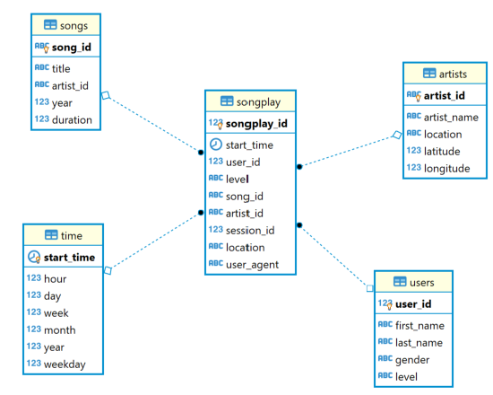
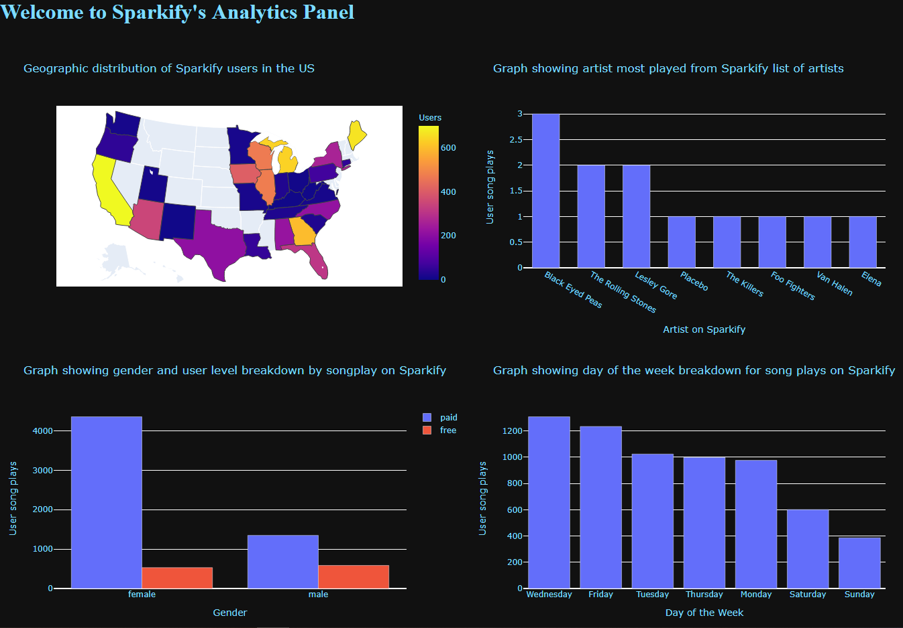

## Project 1 - Building Relational Databases

#### Summary

A startup called Sparkify is looking to create a Postgres database with tables designed to optimize queries on song play analysis. Their analytics team is interested in understanding what songs users are listening to on their new music streaming app.

#### Requirement

1. Build the schema for a Postgres relational database called "sparkifydb"
2. Build 5 tables in a star schema arrangement (1 Fact table and 4 Dimension tables)
3. Create an ETL pipeline to import their existing data for song play analysis
4. Create a query to test for which songs within the app are played in the user logs

#### Process

1. A python script that creates a new sparkify database is programmed using [create_database.py](create_database.py).
2. Drop table and create table individual queries were programmed for each table in [sql_queries.py](sql_queries.py). One large list of queries is created to designate the sequence in which each table must be created (with the songplay table being created last because table will have foreign keys linking to the 4 other dimension tables). *CONSTRAINT ... FOREIGN KEY* expressions are used in the song play table to create the star arrangement.
3. The create table script is programmed to ([create_tables.py](create_tables.py))
4. The insertion queries is programmed for each table that requires data
5. The [etl.py](etl.py) script is created to extract the data and transform it into a form that will be accepted by the tables. *ON CONFLICT DO NOTHING* expressions are added to bypass duplicate record insertions. *ON CONFLICT UPDATE* expressions are used for the users table as some **free** users at the start of the month become **paid** users by the end of the month

#### How to run it

1. Run create_tables.py
2. Run etl.py
3. Run test.ipynb

## Files and Directory

    ├── .gitignore					<- List of ignored files for git repository.
    ├── README.md          			<- The top-level README for understanding the project.
    ├── data						<- Directory for all data used in sparkify DB.
    │   ├── log_data       			<- User log data for sparkify DB.
    │   ├── song_data        		<- Song and artist data for sparkify DB.
    │   └── SongCSV.csv      		<- Additional song and artist data
    │
    ├── create_database.py			<- Script for creating sparkify DB
    ├── create_tables.py			<- Script for creating all tables within sparkify DB
    ├── ERD.png						<- Entity relationship diagram pictorial
    ├── etl.py						<- Extract transform and load script for sparkify DB
    ├── sng_anlys_dbrd.ipynb		<- Jupyter notebook for sparkify analytics dashboard
    ├── song_analysis_queries.py	<- Additional queries for song analysis
    ├── sparkify_analytics.png		<- Dash sparkify analytics dashboard picture
    ├── sql_queries.py 				<- SQL Script for creating and inserting data in tables
    └── test.ipynb            		<- Jupyter notebook testing for data within sparkify DB

#### Entity Relationship Diagram (ERD)

#### Results

- The most played artist was **Black Eyed Peas**
- The most songs are played on **Wednesday**
- Most active group is **female users who pay for Sparkify**
- Most active regions of the US are **California** and **Maine**